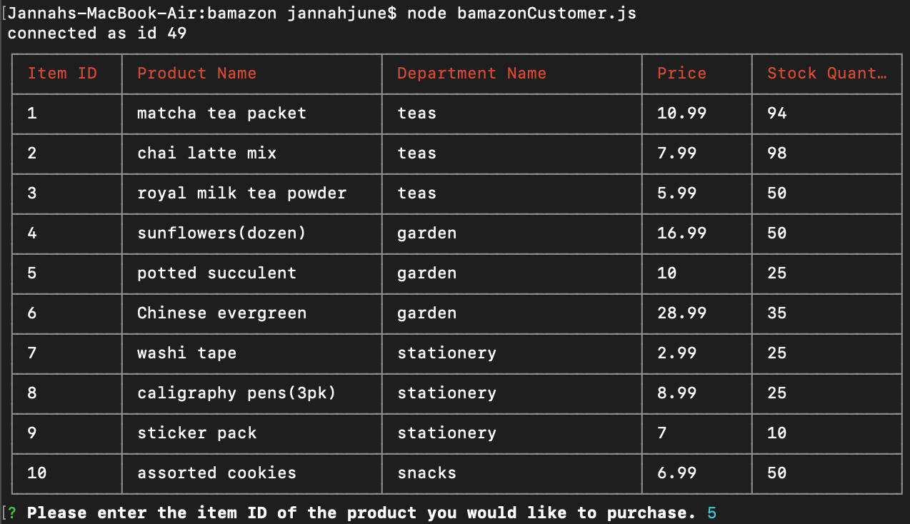
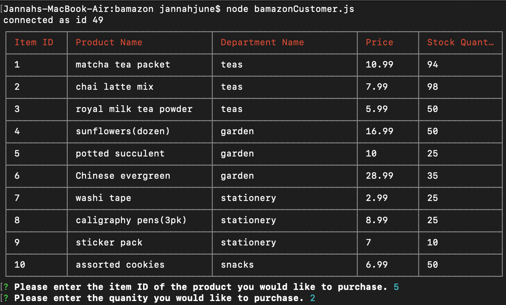
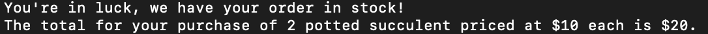
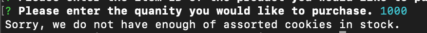

# bamazon

## Overview
Bamazon: an Amazon-like storefront that will take in orders from customers and deplete stock from the store's inventory.

## Instructions
* In terminal, navigate to the root folder of the app
* Enter `node bamazonCustomer.js` to start the app and see what items are available to purchase
* The terminal will then display a table of items that Bamazon carries and how much of each is in stock
* The terminal will then prompt you to select the item you want to purchase by entering in the id.

* Then, you will be prompted to enter the amount of that item you would like to purchase. 

* Your total amount will be calculated and Bamazon's inventory will be updated. 

* No worries, if your item is not in stock, Bamazon will let you know. 

## Link
[Link to the Live Site](https://jnieves14.github.io/bamazon/)

It's a command line app, so opening the live site won't show much. >.<

## Preview of bamazonCustomer.js

## Preview of bamazonManager.js

## Technologies Used
* mySQL
* optional .csv file to import to mySQL
* Node.js
* javascript
* [Inquirer](https://www.npmjs.com/package/inquirer)
* [Table](https://www.npmjs.com/package/cli-table)